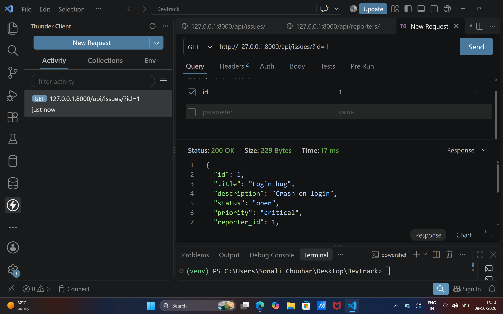
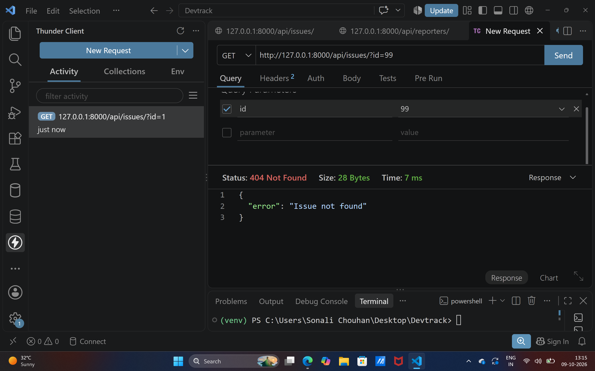

# DevTrack - Object-Oriented Issue Tracker API

A Django-based REST API built with custom OOP models and local JSON file persistence (`issues.json` and `reporters.json`)[span_1](start_span)[span_1](end_span)[span_2](start_span)[span_2](end_span).

## How to Run the Project

1. **Clone the repository:**
   ```bash
 git clone [https://github.com/sonalic956-dot/Devtrack.git](https://github.com/sonalic956-dot/Devtrack.git)
   cd Devtrack

## Set up virtual environment and install django
python -m venv venv
# On Windows:
venv\Scripts\activate
pip install django

## Start the development server
python manage.py runserver

## Test Screenshots

### 1. Success Response (200 OK)


### 2. Failure Response (404 Not Found)

